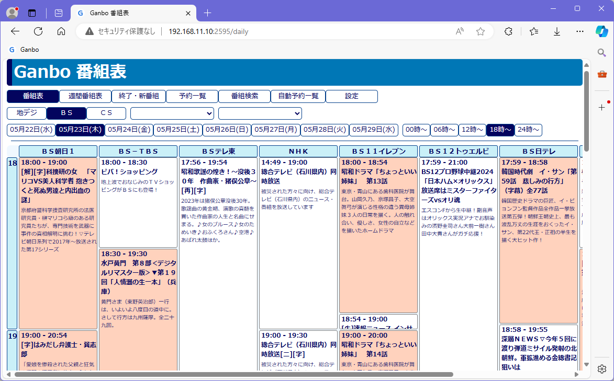
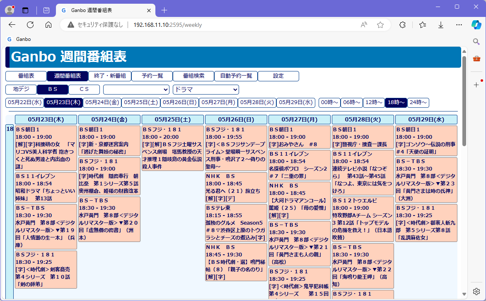
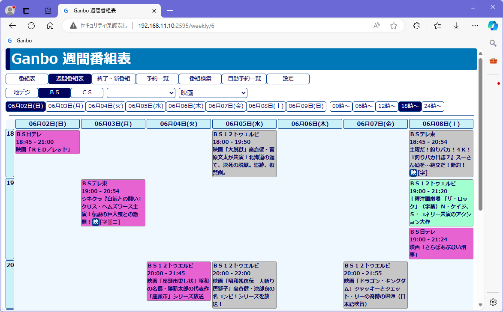
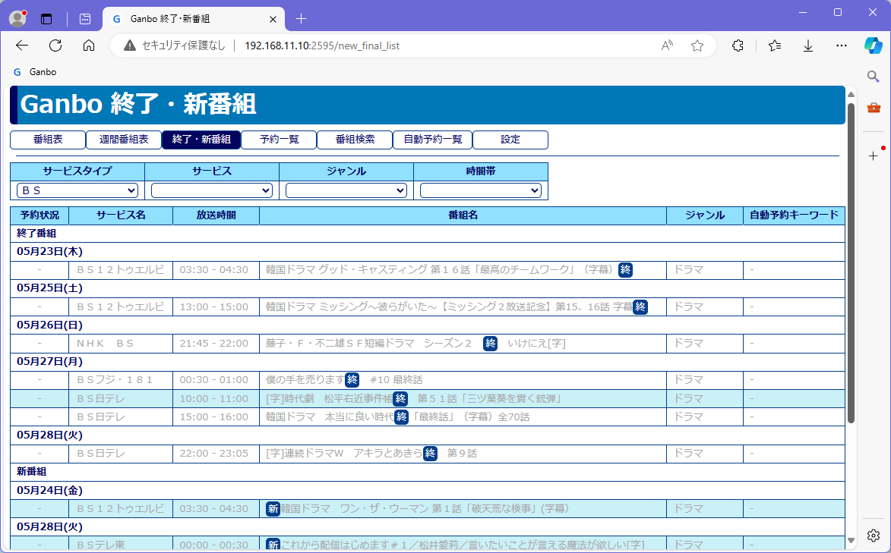
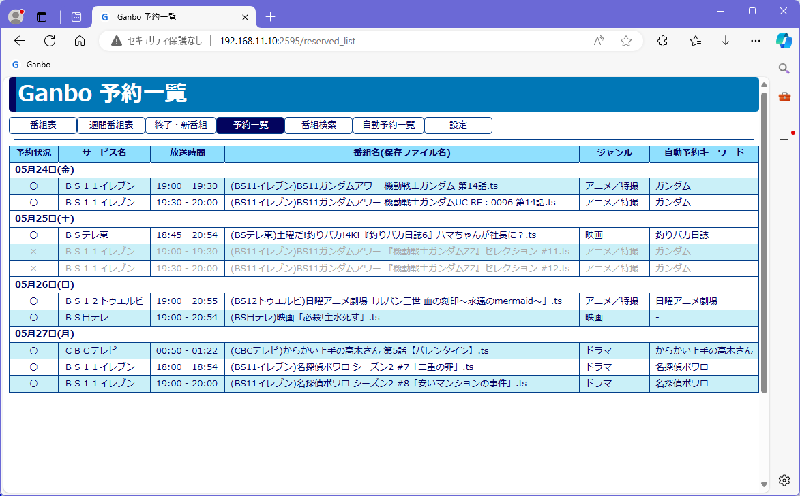
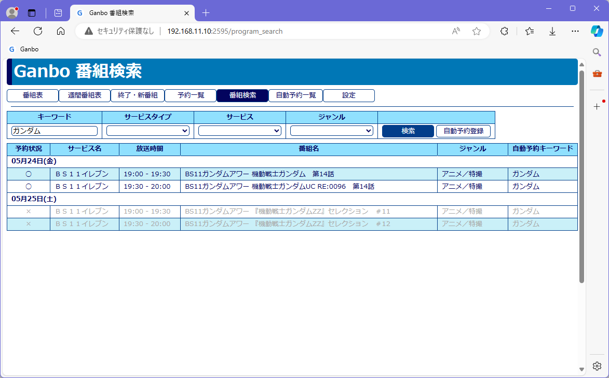
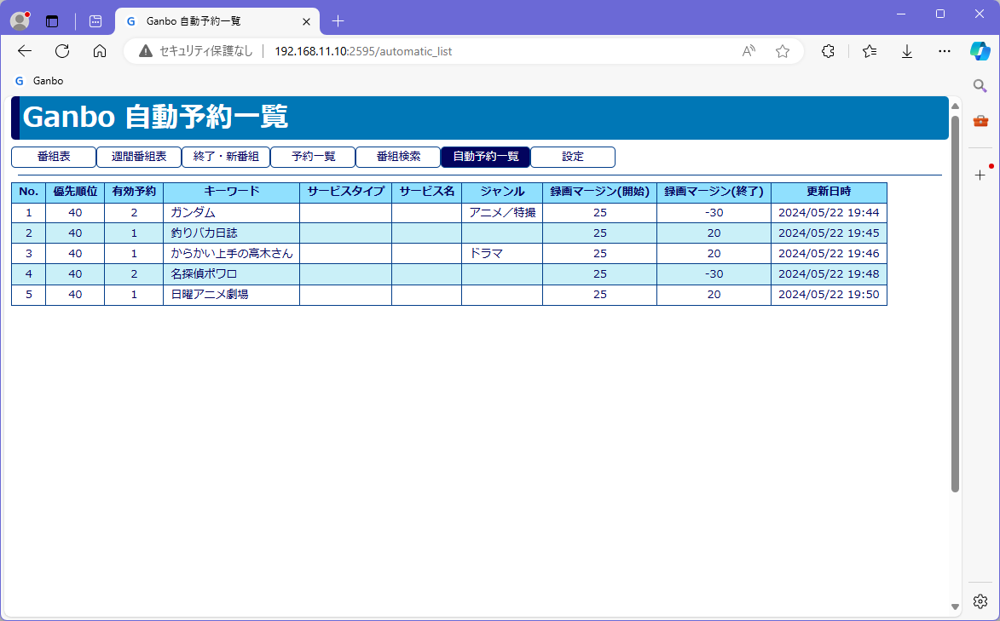
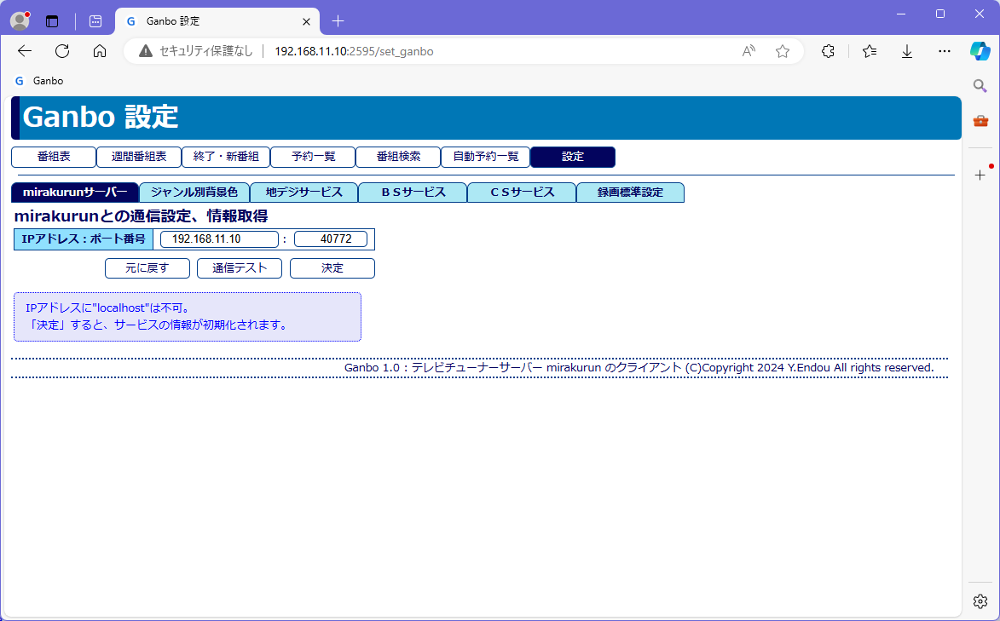

# Ganbo ver.1.0

## Ganboとは何か
- Ganboは、TV  チューナーサーバー  [Mirakurun](https://github.com/Chinachu/Mirakurun)  のクライアントです。
- 番組表を表示して録画管理するだけの低機能なソフトです。<br>
	低機能なだけに、簡単に使えます。<br>
- テレビ番組を録画しておいて時間のあるときに見るという人向けのソフトです。
- 本ソフトよりも高機能なソフトとして、  [Chinachu](https://github.com/Chinachu/Chinachu)  、  [EPGStation](https://github.com/l3tnun/EPGStation)  、  [KonomiTV](https://github.com/tsukumijima/KonomiTV)  などありますが、自分で使いやすいソフトが欲しかったので、本ソフトを作りました。
- CMカット、エンコード、配信（ファイル共有）、録画ファイル管理機能はありません。[他のソフトと組み合わせ](readme/chart.png)て利用します。

### お願い
年齢的に、最後のプログラミングになる予定です。<br>
ぜひ、フォークして、物足りない機能を追加してください。

## 前提条件
- dockerが動作していること。<br>
	Windowsでも、Linuxでもかまいません。たぶん、Macでも可能。<br>
	dockerのインストール、使い方は参考書や解説してあるホームページを見てください。
- Mirakurunが動作していること。<br>
	<span style="font-weight:bold;">Mirakurunは固定IPで運用してください。</span>
	TVチューナーやカードリーダー(BCAS CARD)も動作していることこと。<br>
	GanboはTVチューナーにアクセスしませんが、Mirakurunが正常動作していないと話が始まりません。<br>
- インターネットにアクセス可能なこと。<br>
	dockerイメージを構築する際に必要です。
- Linuxの場合、パーミッションを適切に設定できること。

## インストール
録画ファイルの容量は、１時間の番組で7～8GBありますので、大容量(例えば8TB)のHDDが付いているPCにインストールしてください。<br>
<span style="color:red;">決して外部からアクセスできるPCにインストールしないでください。<br>
場合によっては損害賠償を請求されることがあります。<br>
また、録画したデータをインターネットに公開してはいけません。損害賠償請求されます。(注意喚起)</span><br>
<span style="font-weight:bold;">Mirakurunと同じPCを利用する必要はありません。</span><br>
もちろん、同じPCにインストールできます。<br>

1. GitHubのファイルをダウンロード<br>
	適当なディレクトリに展開します。<br>
1. compose.ymlの編集(<span style="color:red;">必須</span>)<br>
	fastapiサービスのバインドマウントの部分をインストールするPCに合わせて書き換えてください。<br>
	Linuxの場合は、
	```
	- /mnt/ts:/mnt/ts
	```
	ホスト側の  /mnt/ts  はすべてのユーザーで読み書き可能にしておくことをお勧めします。<br>
	Windowsの場合は、
	```
	- D:\TS:/mnt/ts
	```
	などとします。<br>
	この設定が悪いとdocker imageの作成に失敗します。<br>
	ディレクトリのパーミッションは、すべてのユーザーが読み書きできるように設定してください。<br>
	詳しくは[compose.ymlのカスタマイズ](readme/compose.md)を見てください。
1. dockerイメージ、コンテナの作成<br>
	```
	docker compose build
	docker compose up -d
	docker compose stop
	docker compose start
	```
	本来は、`docker compose up -d`だけで良いはずなのですが、なにゆえか、データベースサーバーのアクセスに失敗しますので、1回stopして再起動する必要があります。<br>
	イメージ作成後は`docker compose start`で起動できます。<br>
	docker image  作成時に、必要なソフトをダウンロードして実行環境を整えています。

## アンインストール
1. dockerコンテナ、イメージの削除<br>
	compose.ymlのあるディレクトリで、
	```
	docker compose down --rmi all --volumes --remove-orphans
	```
	と実行してください。
1. 関連ファイルの削除<br>
	インストールの際に展開したファイルを、ディレクトリごと削除してください。<br>
	```__pycache__```  がrootで作られていて削除できない場合は、root権限を使ってください。

## 設定
1. Ganboへのアクセスと設定<br>
	Mirakurunが動いていることが前提です。<br>
	ブラウザで、`http://GanboをインストールしたPCのIPアドレス:2595/`にアクセス。<br>
	「設定」ボタンをクリックし、タブを左から順にアクセス＆セットします。<br>
	詳しくは[設定の詳細](readme/setting.md)を見てください。

## アクセス・使い方
使えば分かるソフトです。(^_^)<br>
アクセスは、GanboをインストールしたPCのIPアドレスを  addr  とするとき、  
| 機能 | アドレス |画面イメージ|
|:---|:---|:---|
|番組表| http://addr:2595 <br>http://addr:2595/daily|[](readme/00_daily.png)|
|週間番組表| http://addr:2595/weekly |[](readme/01_weekly.png)|
|週間番組表<br>ジャンル指定| http://addr:2595/weekly/n <br>nは  0  から 15|[](readme/01_weekly6.png)|
|終了・新番組|http://addr:2595/new_final_list|[](readme/02_new_final.png)|
|予約一覧|http://addr:2595/reserved_list|[](readme/03_reserved_list.png)|
|番組検索|http://addr:2595/program_search|[](readme/04_search.png)|
|自動予約一覧|http://addr:2595/automatic_list|[](readme/05_automatic.png)|
|設定|http://addr:2595/set_ganbo|[](readme/06_setting.png)|
|自動ドキュメント生成<br>(開発者用)|http://addr:2595/docs  Swagger UI<br>http://addr:2595/redoc  ReDoc||

です。ブックマークをしておくと便利です。<br>
アドレスはIPアドレスでなく、`localhost`でもかまいません。<br>
[録画予約は、番組セルをクリック](readme/reserve.md)して行います。

## ライセンス
[BSDライセンス](https://e-words.jp/w/BSD%E3%83%A9%E3%82%A4%E3%82%BB%E3%83%B3%E3%82%B9.html)です。<br>
ぜひ、フォークしてもっと良いソフトを作ってください。<br>
ソフト名を変えてもかまいません。

## 注意事項
- サポートは行いません。(無保証)
- 自己責任で使う事ができる人のみ使用してください。<br>
使用した結果、どのような損害が生じても作者は責任を負いません。(作者の免責)
- 家庭内でのみ利用してください。<br>
	ユーザー認証はありません。<br>
	セキュリティーについて基本的なことしか考慮していません。<br>
	インターネットからアクセスできるようにしておくことは大変危険です。
- 番組追従機能（スポーツ中継が延びて、放送時間が変わることに対応する機能）はありません。
- チューナーの数を管理していません。<br>
	チューナーの数以上に予約を重ねたときどうなるか分かりません。
- CS、有料放送はテストしていません。
- すでにファイルがある場合上書き保存します。（名前を変えて保存することはありません）
- Microsoft Edge  ではブラウザを閉じてもクッキーが無効になりません。<br>
	バックグラウンドで幾つかのEdgeに関するプロセスが動いているようです。
- 番組検索は、まれに関係のない番組を拾ってくることがあります。（「ドイツ」検索問題）<br>
	照合順序を  utf8mb4_unicode_ci  にした副作用です。
- スレートデバイス(タブレット、スマートフォンなど)のことは考えていません。

## 謝辞
- 本ソフトは、  [Mirakurun](https://github.com/Chinachu/Mirakurun)  と  [Rivarun](https://github.com/Chinachu/Rivarun)  を利用しました。<br>
	作者、および、関係者の方に深く感謝します。<br>
	Mirakurun  、  Rivarun  ときましたので、本ソフトの名前を  Ganbo  にしました。
- 番組表の作成にあたっては、[CSSグリッドレイアウトで番組表（ラテ欄）を試作してみたよ](https://tercel-tech.hatenablog.com/entry/2019/07/06/190452)  (2023/12/02確認)を参考にしました。<br>
	作者の方に深く感謝します。
- 多くの技術情報を参考にしました。<br>
	参考にしたホームページのURLをソースコードに記して感謝します。<br>
	URLの末尾にある数字は、ホームページを閲覧した日付です。

## その他
- ソースファイルは技巧的な書き方をしていませんが、python(FastAPI , Jinja2) , HTML , CSS , JavaScript(jQuery) , SQL  が絡み合っているので、分かりづらいかもしれません。<br>
	本当は、Vue.jsなども使い、REST fullなソフトや、SPA(シングルページアプリケーション)を作りたかったのですが、力が及びませんでした。<br>
	もっとも、番組表にRESTやSPAが適しているとは思えませんが……。<br>
	ちなみに、pythonのプログラムは２回目、FastAPI , Jinja2のプログラムは１回目なので、理解が十分でないところや書き方が不統一なところがあります。<br>
	適宜注釈を参考にしてください。<br>
	<!-- 今回も「即値」「番兵」を多く使ってしまった。(;_;) -->
- 番組表は、意外と簡単な方法で作成しています。<br>
	番組表表示後のHTMLソース、g00.cssをご覧ください。
- 配信サービスでテレビ番組を視聴するのが主流となっています。テレビ番組を録画しておいて時間のあるときに見るという人はどのくらいいるのでしょうか。


## 参考
Mirakurunの環境を整えるために次のホームページを参考にしました。<br>
情報公開してくださっている方に感謝します。

1. [2023年8月版 45分で作れる自宅録画サーバー](https://www.digital-den.jp/simplelife/archives/7655/2023%e5%b9%b48%e6%9c%88%e7%89%88-45%e5%88%86%e3%81%a7%e4%bd%9c%e3%82%8c%e3%82%8b%e8%87%aa%e5%ae%85%e9%8c%b2%e7%94%bb%e3%82%b5%e3%83%bc%e3%83%90%e3%83%bc%ef%bc%88ubuntu-22-04-3lts/)  (2024/04/10確認)<br>
	Ubuntu  に  TVチューナーのドライバーを入れ、MirakurunとEPGStationをインストールする手順が、簡単なスクリプトファイルにまとめられています。
1. [物理PC Ubuntu22.04 LTSにPT3環境を設定してみる](https://horaku.shonanwalker.com/post-3099/)  (2024/04/10確認)<br>
	PT3を利用して、UbuntuでMirakurun-EPGStationを作っています。<br>
	ホームページにはUbuntuにPT3ドライバーが含まれていると書いてありますが、最新のLinuxにはPT3のドライバーがインプリメントされているようです。<br>
	私は[openSUSE](https://www.opensuse.org/) Leap-15.5  を利用しましたが、何もしなくてもPT3を認識してくれていました。

## 開発・確認環境
- 開発と動作確認<br>
	Windows11(10) , docker desktop  , FireFox<br>
	mirakurun  と通信してデータを保存することもできました。
- 動作実証<br>
	openSUSE Leap-15.5  ,  PT3  ,  Mirakurun  ,  EPGStation  ,  docker  ,  FireFox<br>
	mirakurun  が  Linux  で動いていますので、動作実証としました。mirakurun , EPGStation , Ganbo  がdockerの中で動いています。
	ただし、EPGStationは使っていません。<br>
	PT3を使ったので、環境構築が楽だったと思っています。<br>
	Sambaでファイル共有して、Windowsで利用しています。

本ファイル(markdown形式)をMicrosoft Edgeで表示するには、「Markdown Viewerのインストールと設定について」  https://zenn.dev/kabec_dev/articles/cd34f2e2f32662  (2024/04/21確認)を参考にしてください。
