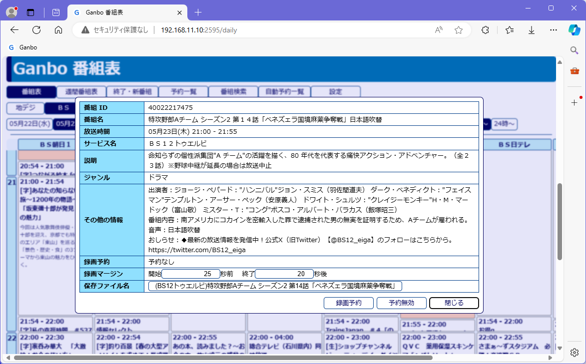

## 録画予約
番組名をクリックすると、番組情報ダイアローグが表示されます 
 
- 録画マージン、保存ファイル名は録画標準設定から作られます。 
- 録画マージンについて、NHK、映画は終了時刻まで放送されることがありますので、終了+20秒程度にしてください。 
- 保存ファイル名は、基本的に番組名ですが、シリーズものなのに話数が入っていないとき、「最終話」と入れたいときなどに編集します。 
すでに同じ名前のファイルがある場合、上書き保存しますので、ファイル名に話数を加えるなど保存ファイル名を変更してください。 
- 「録画予約」、「予約無効」のボタンを押して予約を確定します。 
「予約無効」は再放送などで予約したくない場合の目印をつけます。
