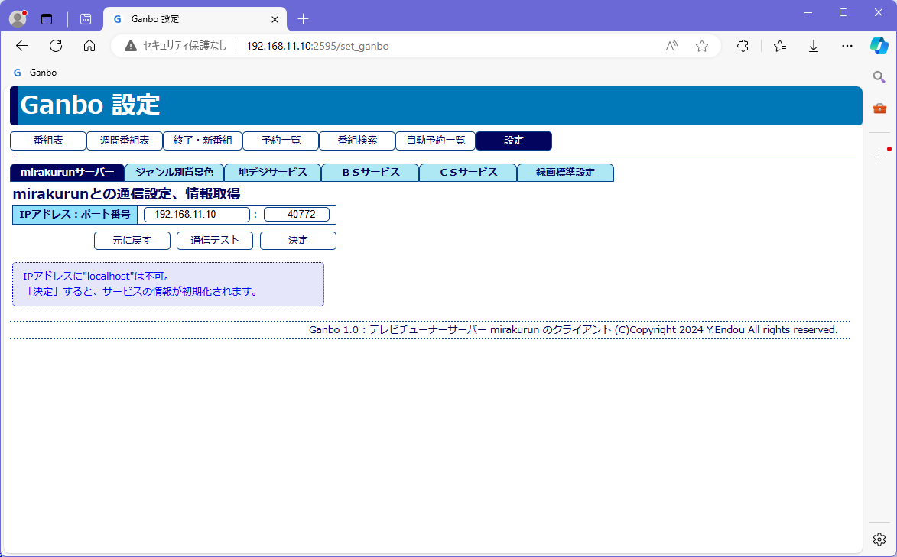

# 設定の詳細

## 設定画面
設定ボタンを押すと、設定画面がでます。 
 
設定タブを左から順に操作することで設定が完了します。

## 1. mirakurunとの通信設定
 
1. IPアドレス、ポート番号を設定します。 
IPアドレスに `localhost` は不可です。 
mirakurunがインストールしてあるPCのIPアドレスを調べて入力してください。
1. 「通信テスト」ボタンを押します。 
mirakurun  のバージョンと、チューナーの情報が表示されることを確認してください。 
通信エラーが出た場合は、IPアドレスやポート番号を見直してください。
1. 「決定」ボタンを押します。 
地デジ、ＢＳ、ＣＳサービスの情報をクリアして、mirakurunより取得します。 
ジャンル別背景色などは影響を受けません。

## 2. ジャンル別背景色の設定
 
番組表、週間番組表の番組セルの背景色を設定します。 
初期値は白色で、興味があるジャンルに色を付けます。 
図では、ドラマ、映画、アニメに色を付けています。 
※注意：ブラウザのキャッシュをクリアして再読込しないと、設定が反映されないことがあります。

## 3. サービスの設定
地デジ、ＢＳ、ＣＳサービスのタブで設定します。 
 
表示されるサービスは、mirakurunの設定で変わってきます。
1. 番組表に出したいサービスをチェックする。
1. 番組表の左に表示したいサービスの表示順の値を小さくする。
1. 決定ボタンを押す。

## 4. 録画標準設定
録画標準設定タブでその他の設定を行います。 
 
1. 番組情報更新時刻設定 
mirakurunから番組情報を取得する時刻を設定します。 
「即更新」ボタンで、設定時刻にかかわらず番組情報を取得します。 
番組情報の取得後、録画予約を再構築します。
1. 録画マージン設定 
一般の番組は、ちょうどの時間に始まり、余裕を持って終わりますので、開始25秒前、終了-30秒前程度に設定しておくのが無難です。 
番組の終わりはほとんどコマーシャルですので、終了時刻はもっと低い値でも良いかもしれません。 
NHK、映画は終了時刻まで放送されることがありますので個別に、終了を+20秒程度に設定してください。
1. 保存ルートの設定を変える必要はありません。 
変える場合は、compose.ymlも変えて、dockerのイメージ、コンテナを再構築する必要があります。
1. 保存ファイル名（マクロ）は適当に変えてください。 
保存ファイル名は番組名を使いますが、番組名の中にはファイル名としてふさわしくない文字や、第Ｘ話という回数が入っていない場合があります。 
本ソフトでは、番組名とは別に保存ファイル名をデータとして持っています。
